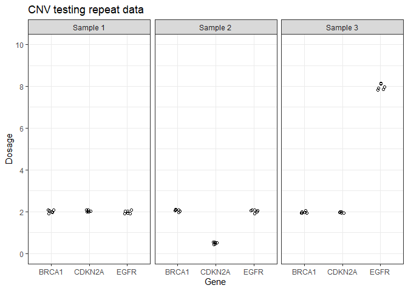

<!-- README.md is generated from README.Rmd. Please edit that file -->

# uncertain

<!-- badges: start -->
<!-- badges: end -->

`uncertain` is a package for performing uncertainty of measurement
calculations. These calculations are used in the validation of genetic
laboratory tests to communicate the variability within an assay.

However, the specific calculations required are sometimes unclear, and
there is a lack of worked examples relating to genomic testing.
`uncertain` aims to address this by providing functions for key
calculations, and example datasets which reflect the data structures
encountered in genomic laboratories.

## Calculating uncertainty

`uncertain` is based on the instructions for pooled standard deviation
analysis described in the publication “Selected Laboratory and
Measurement Practices and Procedures to Support Basic Mass Calibrations”
from the National Institute of Standards and Technology ([NISTIR
6969](https://nvlpubs.nist.gov/nistpubs/ir/2019/NIST.IR.6969-2019.pdf)).
The functions are tested using example calculations from the [NIST
Engineering Statistics
Handbook](https://www.itl.nist.gov/div898/handbook/mpc/section4/mpc441.htm).

`uncertain` includes example datasets for copy number variant and single
nucleotide variant repeatability data.

``` r

library(uncertain)
library(ggplot2)
#> Warning: package 'ggplot2' was built under R version 4.4.3

ggplot(data_cnv, aes(x = gene, y = dosage)) +
  geom_jitter(shape = 21, width = 0.1) +
  theme_bw() +
  facet_wrap(~sample) +
  labs(title = "CNV testing repeat data",
       x = "Gene", y = "Dosage") +
  scale_y_continuous(limits = c(0, 10),
                     breaks = seq(0, 10, by = 2))
```



The key function is `group_stats` which calculates statistical variation
within the dataset based on grouping variables (i.e. sample, gene)
provided by the user.

``` r

knitr::kable(group_stats(data_cnv,
            measurement_variable = dosage,
            sample, gene)[[1]])
```

| sample | gene | mean | standard_deviation | conf_int_95_min | conf_int_95_max | replicates | degrees_freedom | sum_squares | standard_error |
|:---|:---|---:|---:|---:|---:|---:|---:|---:|---:|
| Sample 1 | BRCA1 | 2.0117967 | 0.0728223 | 1.9353743 | 2.0882191 | 6 | 5 | 0.0265155 | 0.0297296 |
| Sample 1 | CDKN2A | 2.0279581 | 0.0449833 | 1.9807510 | 2.0751651 | 6 | 5 | 0.0101175 | 0.0183643 |
| Sample 1 | EGFR | 1.9847034 | 0.0689010 | 1.9123962 | 2.0570105 | 6 | 5 | 0.0237367 | 0.0281287 |
| Sample 2 | BRCA1 | 2.0499848 | 0.0501495 | 1.9973561 | 2.1026135 | 6 | 5 | 0.0125749 | 0.0204735 |
| Sample 2 | CDKN2A | 0.4979573 | 0.0444423 | 0.4513179 | 0.5445966 | 6 | 5 | 0.0098756 | 0.0181435 |
| Sample 2 | EGFR | 2.0284635 | 0.0695623 | 1.9554623 | 2.1014647 | 6 | 5 | 0.0241946 | 0.0283987 |
| Sample 3 | BRCA1 | 1.9694007 | 0.0444302 | 1.9227741 | 2.0160273 | 6 | 5 | 0.0098702 | 0.0181385 |
| Sample 3 | CDKN2A | 1.9590939 | 0.0279047 | 1.9298098 | 1.9883781 | 6 | 5 | 0.0038934 | 0.0113920 |
| Sample 3 | EGFR | 7.9688437 | 0.1372104 | 7.8248502 | 8.1128372 | 6 | 5 | 0.0941335 | 0.0560159 |

## Installation

You can install the development version of uncertain from
[GitHub](https://github.com/) with:

``` r
# install.packages("pak")
pak::pak("joe-m-shaw/uncertain")
```
