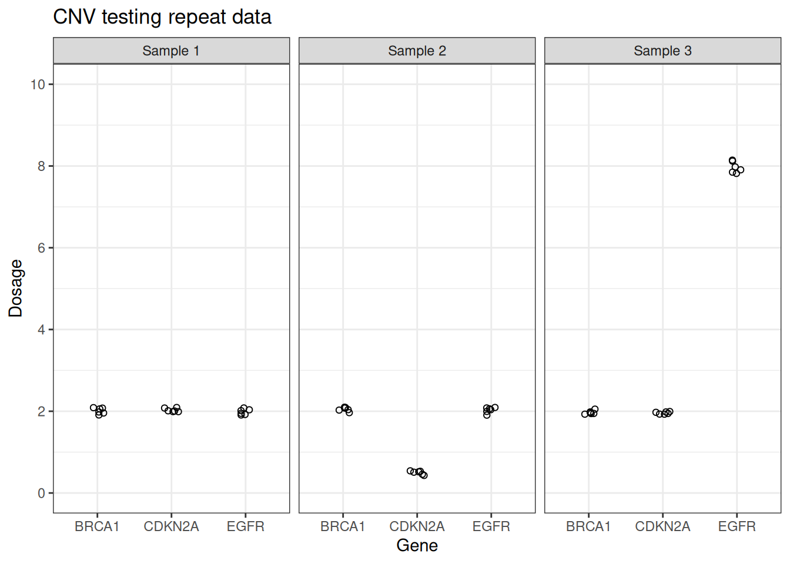

# Quantifying assay variation

`uncertain` contains fake datasets to help with calculating assay
variation. For example, data_cnv includes made-up data for an assay
which measures the dosage of 3 genes (*BRCA1*, *CDKN2A* and *EGFR*) for
3 samples, each of which has been tested 6 times.

``` r

head(data_cnv)
#>     sample replicate  gene   dosage
#> 1 Sample 1         1 BRCA1 1.957516
#> 2 Sample 1         2 BRCA1 2.057661
#> 3 Sample 1         3 BRCA1 1.981795
#> 4 Sample 1         4 BRCA1 2.076603
#> 5 Sample 1         5 BRCA1 2.088093
#> 6 Sample 1         6 BRCA1 1.909111
```



A key aspect of assay development is determining the variability within
the assay. `uncertain` contains the `group_stats` function which
calculates the statistical variation within a dataset based on groupings
supplied by the user.

``` r


knitr::kable(group_stats(data_cnv,
            measurement_variable = dosage,
            sample, gene)[[1]])
```

| sample | gene | mean | standard_deviation | conf_int_95_min | conf_int_95_max | replicates | degrees_freedom | sum_squares | standard_error |
|:---|:---|---:|---:|---:|---:|---:|---:|---:|---:|
| Sample 1 | BRCA1 | 2.0117967 | 0.0728223 | 1.9353743 | 2.0882191 | 6 | 5 | 0.0265155 | 0.0297296 |
| Sample 1 | CDKN2A | 2.0279581 | 0.0449833 | 1.9807510 | 2.0751651 | 6 | 5 | 0.0101175 | 0.0183643 |
| Sample 1 | EGFR | 1.9847034 | 0.0689010 | 1.9123962 | 2.0570105 | 6 | 5 | 0.0237367 | 0.0281287 |
| Sample 2 | BRCA1 | 2.0499848 | 0.0501495 | 1.9973561 | 2.1026135 | 6 | 5 | 0.0125749 | 0.0204735 |
| Sample 2 | CDKN2A | 0.4979573 | 0.0444423 | 0.4513179 | 0.5445966 | 6 | 5 | 0.0098756 | 0.0181435 |
| Sample 2 | EGFR | 2.0284635 | 0.0695623 | 1.9554623 | 2.1014647 | 6 | 5 | 0.0241946 | 0.0283987 |
| Sample 3 | BRCA1 | 1.9694007 | 0.0444302 | 1.9227741 | 2.0160273 | 6 | 5 | 0.0098702 | 0.0181385 |
| Sample 3 | CDKN2A | 1.9590939 | 0.0279047 | 1.9298098 | 1.9883781 | 6 | 5 | 0.0038934 | 0.0113920 |
| Sample 3 | EGFR | 7.9688437 | 0.1372104 | 7.8248502 | 8.1128372 | 6 | 5 | 0.0941335 | 0.0560159 |

`group_stats` also calculates the pooled standard deviation across all
the sample groupings, which quantifies the overall variation within the
assay itself.

``` r


group_stats(data_cnv,
            measurement_variable = dosage,
            sample, gene)[[2]]
#> [1] 0.06910729
```

The grouping step is very important. If the data are not grouped at the
gene level, then biological variation is misinterpreted as assay
variation. For example, the *CDKN2A* deletion within sample 2 and the
*EGFR* amplification within sample 3 leads to higher standard deviations
calculated for these samples compared to sample 1, and the pooled
standard deviation is higher.

``` r


knitr::kable(group_stats(data_cnv,
            measurement_variable = dosage,
            sample)[[1]])
```

| sample | mean | standard_deviation | conf_int_95_min | conf_int_95_max | replicates | degrees_freedom | sum_squares | standard_error |
|:---|---:|---:|---:|---:|---:|---:|---:|---:|
| Sample 1 | 2.008153 | 0.0623567 | 1.977143 | 2.039162 | 18 | 17 | 0.0661021 | 0.0146976 |
| Sample 2 | 1.525468 | 0.7495116 | 1.152745 | 1.898192 | 18 | 17 | 9.5500492 | 0.1766616 |
| Sample 3 | 3.965779 | 2.9137496 | 2.516806 | 5.414753 | 18 | 17 | 144.3289282 | 0.6867774 |

``` r


group_stats(data_cnv,
            measurement_variable = dosage,
            sample)[[2]]
#> [1] 1.737392
```
